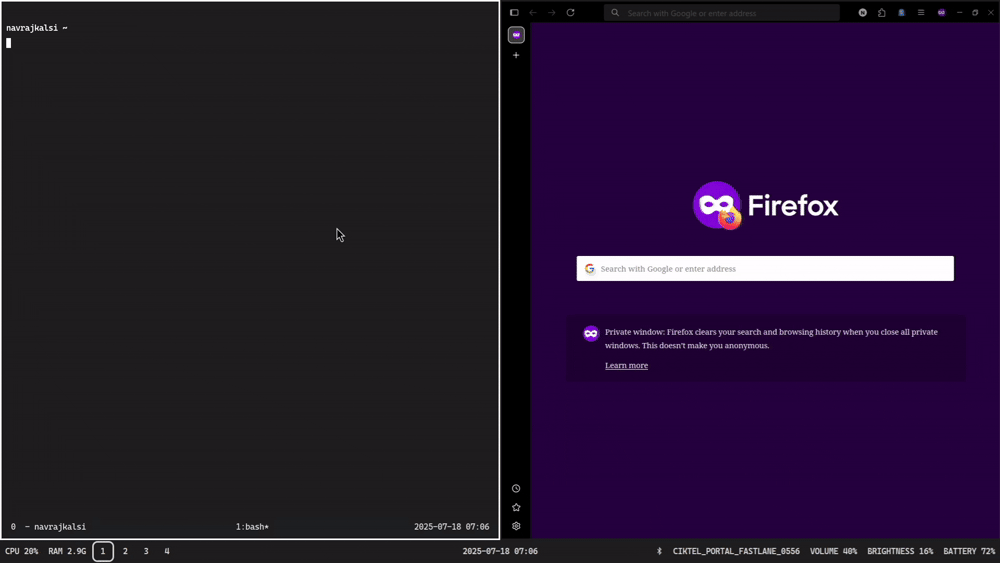

# Server-C



Lightweight HTTP Server in C.
Serves static files, support MIME type detection, handles directory listing (__with vim motions__) and file previews with proper HTTP responses.

## Motivation

I wanted to know more about HTTP requests & servers, request-handling, and have some experience in C.
Plus whenever I was using a local server, I was missing the vim motions to navigate around in the file tree.

So I decided to build one for a hopefully great learning experience and my personal usage.

It would have been a lot easier to do this in JavaScript, but I chose C to get low-level and
get to have some experience with manipulating sockets, file-descriptors, HTTP Protocol with its headers
and MIME types, and the C language in general.

## Worth-Mentioning Points
* Supports __Linux & most UNIX systems__.
* __MIME detection__ ensures proper previewing of file, done using `libmagic`.
* Supported formats for preview: __Text, Images, PDFs__.
* Informs if a requested file is __empty or unsupported__, with help of MIME types.
* __Directory listing__ is done by using a static html file & javascript.
* __Custom 404 page__ is served in case of a 404 response.
* __Clean Shutdown__ is done by handling interrupt and kill signals.

## Quick Start

AS OF NOW, THIS SERVER ONLY SUPPORTS UNIX SYSTEMS.

* For `Windows`, __winsock__ API has to be imnplemented. Although, `WSL` can be used in that case.

* For `Linux`:

### Install Dependencies

`GCC` is used as the compiler & `libmagic` is required for MIME detection.
```bash
#Ubuntu/Debian
sudo apt update
sudo apt install build-essential gcc libmagic-dev
```

* __Clone the Repository__
``` bash
git clone https://github.com/navrajkalsi/server-c
cd server-c
```
* __Make__
```bash
make
make install
```
By default, the binary is installed to __/usr/local/bin__ & the static files required for the
server go in __/usr/local/share/server-c/static__.
You can pass in `STATIC_DIR`, while compiling to change the directory in which the server looks for the static files,
 and `DESTDIR` while installing, to create a staging environment & manage files manually, like:
```bash
make STATIC_DIR=/NEW_STATIC_DIR #NEW_STATIC_DIR is where the program will look for the static files
make DESTDIR=/TEMP_DIR install #TEMP_DIR is where the program files will be installed now (binary & static files)
# Now the user is supposed to put the static files in NEW_STATIC_DIR
make clean
```
__STATIC_DIR CAN ONLY BE CHANGED DURING COMPILATION__, i.e., during `make`, as it is used as a preprocessor macro.

## Usage

The following flags can be used to alter the behaviour of the program:

| __Flag__ | __Flag Description__|
|:----:|:---------------:|
|-a| Listen to connections on all interfaces |
|-d| Debug Mode (Prints all functions calls to the console |
|-h| Print usage on command line |
|-p| Port to listen on |
|-r| Root of the directory to serve |

### Default Usage
```bash
server-c
```
By default:
* Serves the __current working directory__.
* Uses port __1419__.
* Listens to only __localhost__ requests.
* Prints the __request method & path__ on the console.

### Additional Usage Example
```bash
server-c -r /DIR_TO_SERVE -p 8080 -a
```
* Serves 'DIR_TO_SERVE' on port 8080 and listens to all requests from all IPs.
* Here, since we have passed -a flag, we can access files on your machine from different devices by visiting the IP address of your machine and targeting the appropriate port.

### Demo

