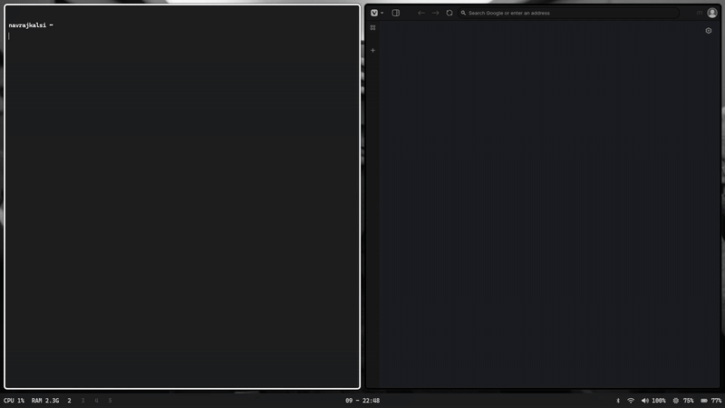

# Server-C



Lightweight HTTP Server in C, with HTTPS support.
Serves static files, supports MIME type detection, handles directory listing (__with basic vim motions__) and file previews with proper HTTP responses.

<br>

## Motivation

I wanted to know more about HTTP requests & servers, request-handling, and have some experience in C.
Plus whenever I was using a local server, I was missing the vim motions to navigate around in the file tree.

So I decided to build one for a hopefully great learning experience and my personal usage.

It would have been a lot easier to do this in JavaScript, but I chose C to get low-level and
get to have some experience with manipulating sockets, file-descriptors, HTTP Protocol with its headers
and MIME types, and the C language in general.

__Update__:
Over the iterations, I have made this server capable of __`hosting a real website`__.
Currently I am hosting my own website using this exact server here: [navrajkalsi.com](https://navrajkalsi.com)

<br>

## Worth-Mentioning Points
* Supports __Linux & most UNIX systems__, as most libraries used are part of the C standard.
* Uses __threads__ for concurrent processing of requests.
* __TLS__ is used to support __HTTPS__, done using `openssl`.
* __MIME detection__ ensures proper previewing of file, done using `libmagic`.
* Supported formats for preview: __Text, Images, PDFs__.
* Informs if a requested file is __empty or unsupported for preview__(can be downloaded in that case), with help of content-type header.
* Supports __keep-alive__ connections with socket timeouts.
* __Directory listing__ is done by using a static html file & javascript.
* __Custom Error Page__ is served in case of any error, which changes dynamically based on the response status code.
* __Clean Shutdown__ is done by handling interrupt and kill signals.
* __URL Decoding__ of ASCII chars from hex digits.

<br>

## Quick Start

AS OF NOW, THIS SERVER ONLY SUPPORTS UNIX SYSTEMS.

<br>

### **Windows**
For `Windows`, __winsock__ API has to be implemented. Although, `WSL` can be used in that case.

<br>

### **Linux** or **WSL**:

<details>
<summary>Install Dependencies</summary>

<br>

The following dependencies are required to build and run the program on Linux:
* `gcc`: C Compiler
* `make`: Project build
* `libmagic`: MIME detection
* `openssl`: TLS handling & HTTPS support

__If using a package manager, please check to see the exact names of these programs for your distro.__
</details>

<details>
<summary>Download the source</summary>

``` bash
git clone https://github.com/navrajkalsi/server-c
cd server-c
```
</details>

<details>
<summary>Build the project</summary>

#### Common Commands
```bash
# Building
make

# Installing the binary & static files
make install

# Cleaning build objects
make clean

# Uninstall
make uninstall
```

#### Build Options
| __Variable__ | __Default__ | __Description__ |
|:----:|:-----------------:| :---------------------: |
| __STATIC_DIR__ | "/usr/local/share/server-c/static" | Directory in which the server will look for static support files(_server.html, _server.js, _error.html, etc). |
| __DESTDIR__ |  | To create a staging environment & manage files manually. |
| __DOMAIN_CERT__ | "/etc/ssl/domain/domain.cert" | Path to domain certificate for HTTPS. |
| __PRIVATE_KEY__ | "/etc/ssl/domain/private.key" | Path to private key for HTTPS. |

<br>

__STATIC_DIR, DOMAIN_CERT & PRIVATE_KEY CAN ONLY BE CHANGED DURING COMPILATION__, i.e., during `make`, as it is used as a preprocessor macro.
</details>

## Usage

__If `server-c` command is not found after installation, the directory in which the binary got installed is not on the PATH.
ADD THE MAKE INSTALLATION DIRECTORY TO THE PATH AND TRY AGAIN.__

<br>

### Flags

The following __flags__ can be used to alter the behaviour of the program:

| __Flag__ | __Flag Description__| __Required Argument__ | __Default__ |
| :----: | :---------------: | :---------------: | :----: |
|-a| Listen to connections on all interfaces of the machine | | Localhost only |
|-d| Debug Mode (Prints all functions calls to the console) | | |
|-h| Print usage on command line | | |
|-p| Port to listen on | Port number | 1419 |
|-r| Root of the directory to serve | Directory path | Current directory |
|-s| Use HTTPS __(Remember to configure HTTPS files)__ | | HTTP only |
|-v| Print version number | | |

<br>

### URL Parameters
The following __url param__ can be used to alter the behaviour, when serving a directory:

| __Param__ | __true__ | __false__ | __Default__ |
| :----: | :----: | :----: | :----: |
| __show_dir__ | Always list directory contents. Ignores index.html, if found. | List directory contents, if no index.html is found. Otherwise, serves index.html when requesting directory. | false |

<br>

### Default Usage
```bash
server-c
```
By default:
* Serves the __current working directory__.
* Uses port __1419__.
* Listens to only __localhost__ requests.
* Uses __HTTP__ only.
* Prints the __client's address, request method & path__ on the console.
* Serves __index.html__, if a directory is requested and index.html is present.

<br>

### Additional Usage Example
```bash
server-c -a -p 8080 -r /DIR_TO_SERVE -s
```
* Serves 'DIR_TO_SERVE' on port 8080 and listens to all requests from all IPs.
* Here, since we have passed -a flag, we can access files on your machine from different devices by visiting the IP address of your machine and targeting the appropriate port.
* Domain certificate & private keys is used to enable TLS.

<br>

### Demo


<br>

## Changelog
See [CHANGELOG.md](CHANGELOG.md) for changes made.
